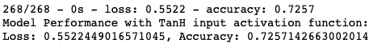
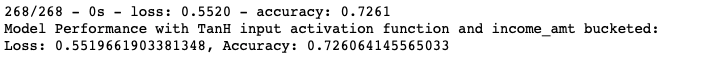
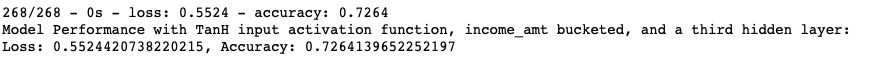

# Neural_Network_Charity_Analysis
The purpose of this analysis is to offer insights to a nonprofit organization about their previous grants and investments to determine which future opportunities should be considered. The model pulls data from a CSV file and is trained on approximately 32,000 data points. 

## Results
The target variable for the model is whether or not the investment was ultimately successful, given as a Yes or No. The model's features are the type of application, the organizations affiliation, classification, use case for the money, organization, status, the organization's income amount, if there are any special considerations (given as a Yes or No), and the actual ask amount of the investment. I removed the name and ID column as this is not trainable data for the model. 

I initially used a RELU activation function for 2 hidden layers with 24 and 12 neurons, 50 epochs, and a sigmoid output function. This yielded model accuracy of 72%. To try and improve model performance, I first changed the activation function of the 2 hidden layers to TanH, however this did not increase the model's accuracy above the RELU activation. 

First attempt: Changing the input activation function to TanH instead of RELU. Results:

I noticed that the income_amount column had a pretty large variance in the distribution, so I aimed to reduce the number of values in that feature using bucketing. I rebucketed income_amount to put all organization's with income over $5 million into one bucket. This rebucketing, paired with the TanH functions, also did not increase model performance significantly. 

Second attempt: Rebucketing the income_amt feature to group all incomes over $5Million as "Other". Results:

Finally, I added a third hidden layer with 6 neurons. This also did not increase model performance past 72% with 50 epochs. 
Third attempt: Failed: Added a third hidden layer with 6. Results:

Overall, I was not able to improve the model performance past the 75% desired threshold. Further analysis would be needed to grow model performance. I'd like to run a RandomForestClassifier on this data, as the features and targets are set up such a way that it might yield better results. Additionally, in the income_amount feature, there are a considerable number of companies that have income of $0. This feels like an unexplained piece of the analysis and might be playing a role in the overall poor model performance. 